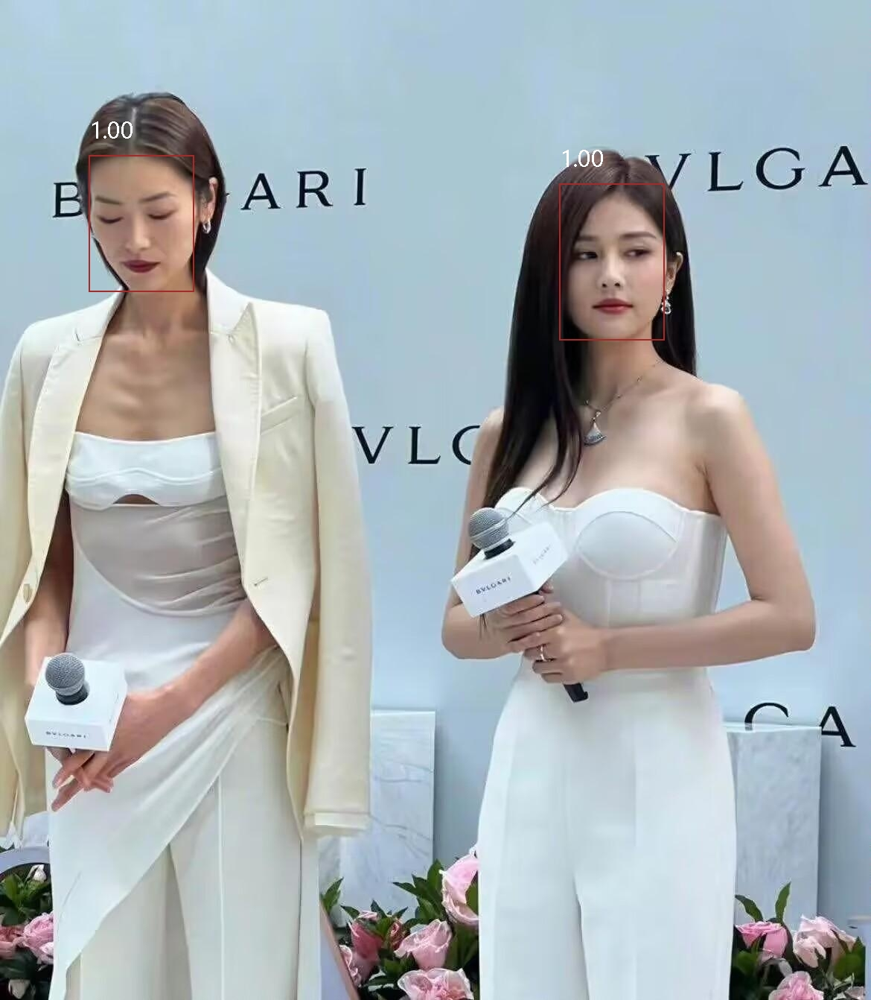
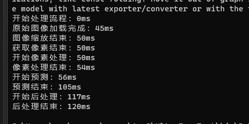

# ML.Net-FaceDetection
使用.net 对图像进行面部识别

说明
https://mp.weixin.qq.com/s?__biz=MzU1MDI5MDIzMw==&mid=2247483667&idx=1&sn=c925a979a860f7851d4376c45364a8de&chksm=fba39745ccd41e53515f71a3461fcebe34d25cd159a5322369bcc2f47d33f0d6ad2379e59a50#rd

识别效果

运行速度

更多模型

https://github.com/onnx/models/tree/f064171f7dd8e962a8a5b34eac8e1bcf83cebbde#onnx-model-zoo
